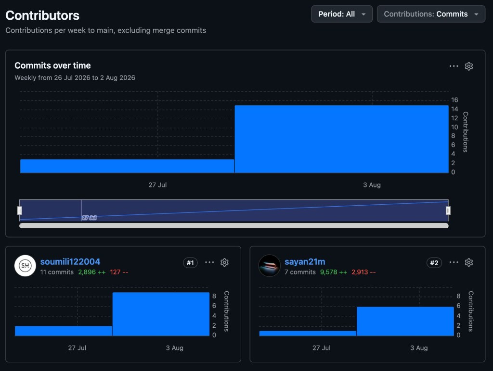

# Fire Before Fire — Project Report

| Field | Detail |
| ----- | ------ |
| **Team** | Spark Squad |
| **Title** | Fire Before Fire — Early Electrical Heating / Fire-Risk Detection |
| **College** | MCKV Institute of Engineering |
| **Department** | Information Technology (IT) |
| **Semester** | Assigned in 3rd; current work in 5th |
| **Date** | 8 August 2026 |
| **Repo** | https://github.com/sayan21m/fire-before-fire |
| **Cloud** | https://fire-before-fire.onrender.com |
| **Expense** | ₹744 (₹186 × 4 members) |

---

## Title page

**MCKV Institute of Engineering**  
**Department of Information Technology**

**Title:** Fire Before Fire — Early Electrical Heating / Fire-Risk Detection  

**Team Spark Squad**

| Role | Name |
| ---- | ---- |
| Leader | Sayan Garai |
| Member | Soumili Hazra |
| Member | Aritra Ghosh |
| Member | Snigdha Das |

**Duration:** 3rd semester (assigned) → 5th semester (current)  
**Expense:** ₹744 (equal share)  
**Guide:** _(for DOCX)_  

---

## Declaration

We declare that **“Fire Before Fire — Early Electrical Heating / Fire-Risk Detection”**, submitted to the **Department of IT, MCKV Institute of Engineering**, is original work by **Team Spark Squad**.

1. The work is our own, under academic guidance; tools and literature are acknowledged.  
2. This report has not been submitted for any other award.  
3. Sources are acknowledged to the best of our knowledge.  

| Name | Signature | Date |
| ---- | --------- | ---- |
| Sayan Garai (Leader) | | |
| Soumili Hazra | | |
| Aritra Ghosh | | |
| Snigdha Das | | |

**Place:** ____________ **Date:** ____________

---

## Acknowledgement

We thank **MCKV Institute of Engineering** and the **Department of IT** for this project (3rd–5th semester). We thank our guide and faculty for guidance during design, build, and documentation of **Fire Before Fire**.

Thanks to **Spark Squad** (Sayan Garai, Soumili Hazra, Aritra Ghosh, Snigdha Das) for equal expense sharing (**₹744**) and joint work on hardware, software, testing, and docs. We also thank the ESP32 / PlatformIO / Node.js open-source stack and cloud hosting used in the prototype.

**— Team Spark Squad**

---

## Abstract

**Fire Before Fire** is a local-first ESP32 IoT prototype for early electrical heating risk. It senses **current** (ACS712) and **temperature** (DS18B20), derives heating features, and warns via a SoftAP dashboard.

Scoring uses a rule engine, on-device **GNB**, **softmax LR**, and a confidence-weighted **ensemble**. Data persists on flash; optional home Wi‑Fi syncs to Render for model refit and **OS Web Push**. For academic demo only—not certified fire safety.

**Keywords:** ESP32, ACS712, DS18B20, SoftAP, GNB, softmax LR, ensemble, IoT.

---

## 1. Introduction

### 1.1 Motivation

Overcurrent and conductor heating often precede fire. Low-cost local monitoring of pre-fire dynamics aids teaching and demos better than cloud-only or smoke-only systems.

### 1.2 Objectives

1. Sense current and temperature on ESP32.  
2. Extract heating features (slopes, variance, acceleration).  
3. SoftAP live UI without phone internet.  
4. Rules + GNB + LR ensemble for warn/critical.  
5. Persist labels; optional cloud sync.  
6. In-app (WebSocket) and OS (Web Push) alerts.  

### 1.3 Scope

**In:** single node, SoftAP UI, flash persist, Render ingest/refit/push.  
**Out:** multi-site deploy, smoke/flame sensors, certified safety, signed OTA.

---

## 2. Related work

| Theme | Relevance |
| ----- | --------- |
| IoT fire monitors | Often smoke/gas; we target **I + T** heating precursors |
| ESP32 SoftAP UIs | Local demo without a router |
| Classical ML on MCU | GNB / linear LR fit ESP32; no deep models |
| Ensembles | Confidence fusion of GNB + LR |

---

## 3. Team & budget

| Name | Role | Focus |
| ---- | ---- | ----- |
| **Sayan Garai** | Leader | Firmware, ML, cloud, persist (`sayan21m`) |
| **Soumili Hazra** | Member | SoftAP / UI (`soumili122004`) |
| **Aritra Ghosh** | Member | Support (assembly, test, docs, presentation) |
| **Snigdha Das** | Member | Support (assembly, test, docs, presentation) |

**Budget: ₹744** → **₹186 / member**

| Part | Role |
| ---- | ---- |
| ESP32 | MCU, SoftAP, STA, ML |
| ACS712 | Current → GPIO 34 |
| DS18B20 | Temp → GPIO 4 |
| Resistor | ~4.7 kΩ pull-up |
| Breadboard | Prototype |
| Jumpers | Wiring |

---

## 4. Requirements

| ID | Functional |
| -- | ---------- |
| FR1 | Sample ACS712 + DS18B20 |
| FR2 | Features + risk (rules/ML) |
| FR3 | SoftAP UI at 192.168.4.1 |
| FR4 | Persist dataset on reboot |
| FR5 | Cloud ingest + model pull |
| FR6 | In-app + OS alerts |
| FR7 | Sensor IDs under deviceId |

| ID | Non-functional |
| -- | -------------- |
| NFR1 | Works offline on SoftAP |
| NFR2 | Unique SoftAP pass; API key in Settings |
| NFR3 | HTTPS with CA verify |
| NFR4 | Academic prototype, not certified product |

---

## 5. Hardware

| # | Part | Notes |
| - | ---- | ----- |
| 1 | ESP32 | SoftAP + app |
| 2 | ACS712 | ADC **GPIO 34** |
| 3 | DS18B20 | 1-Wire **GPIO 4** + pull-up |
| 4 | Resistor | DS18B20 pull-up |
| 5 | Breadboard | Assembly |
| 6 | Jumpers | Interconnect |

\[
P \approx 230\,\mathrm{V} \times |I|
\]

Used in UI/rules; excluded from ML features. Mains work needs isolation; lab/demo use only.

---

## 6. Architecture

```
ACS712 (GPIO 34) ─┐
                  ├─► ESP32 + LittleFS ─ SoftAP ─► Phone (192.168.4.1)
DS18B20 (GPIO 4) ─┘         │
                            ├ Features → Rules
                            ├ Dataset → /dataset.bin
                            ├ GNB + Softmax LR → Ensemble
                            └ STA → Render (ingest, refit, Web Push)
```

| Layer | Detail |
| ----- | ------ |
| Sense | ACS712, DS18B20 |
| Features | MA3, slopes, var, power, tempAcc |
| Alerts | Live thresholds + debounce |
| Train labels | Fixed bands (≠ adaptive alerts) |
| ML | GNB + LR + ensemble |
| UI | SoftAP PWA |
| Cloud | Ingest, GNB/LR refit, `/notify` |
| ID | deviceId + I-01 / T-01 locations |

---

## 7. Design

### 7.1 Features

| Feature | Source |
| ------- | ------ |
| currentA, tempC | Sensors |
| ma3I, ma3T | Moving averages |
| currentSlope, tempSlope | ~5 s |
| varI, tempAcc | History |
| powerW | 230×\|I\| (rules only) |
| target | Fixed train bands 0/1/2 |

ML (8): \|I\|, T, \|MA3I\|, MA3T, \|dI/dt\|, \|dT/dt\|, varI, \|d2T\|.

### 7.2 Rules vs labels

Alerts use `params[]`. Dataset uses fixed `TRAIN_LABEL` (limits leakage).

### 7.3 Models

- **GNB:** fit or cloud import → posteriors  
- **LR:** offline `ml_model/` or online `cloud/lib/logreg.js` → softmax  
- **Ensemble:** conf-weighted average; override if conf ≥ 0.55 and ≥ rule conf  

### 7.4 Persist & sync

| Item | Behavior |
| ---- | -------- |
| `/dataset.bin` | Labeled rows; wiped by `uploadfs` |
| `/cloud_cfg.json` | STA + API key |
| Models | `/gnb_model.json`, `/softmax_logreg.json` |
| Auto sync | ≥24 rows, ~5 min → pull GNB+LR |
| TLS | `src/certs.h` |

### 7.5 Alerts

| Channel | Use |
| ------- | --- |
| WS :81 | SoftAP in-app |
| Web Push | OS after `/notify` |

---

## 8. Implementation

| Area | Paths |
| ---- | ----- |
| Firmware | `src/main.cpp`, `certs.h` |
| UI | `data/` |
| Offline LR | `ml_model/` |
| Cloud | `cloud/` |
| Seed | `dataset/`, `cloud/seed/` |

**Stack:** PlatformIO, LittleFS, ArduinoJson, WebSockets, Express, NumPy (optional), Tailwind.

---

## 9. GitHub contributions

GitHub Contributors, **26 Jul–8 Aug 2026**, `main`, exclude merges:



| Rank | User | Member | Commits | ++ | -- |
| ---- | ---- | ------ | ------: | -: | -: |
| 1 | `soumili122004` | Soumili Hazra | 11 | 2,896 | 127 |
| 2 | `sayan21m` | Sayan Garai | 7 | 9,578 | 2,913 |

Peak week: **3 Aug 2026**. Soumili: more commits (UI). Sayan: more lines (firmware/ML/cloud). Aritra & Snigdha: equal expense/delivery; work may be outside this `main` commit window.

| Branch | Focus |
| ------ | ----- |
| `main` | Integration |
| `hardware-sg` | Firmware |
| `software-sh` | UI |

---

## 10. Reproduce

```bash
git clone https://github.com/sayan21m/fire-before-fire.git
cd fire-before-fire
pio run -t upload --upload-port <port>
pio run -t uploadfs --upload-port <port>
```

1. Serial 115200 → SoftAP password (`fbf…`)  
2. Join FireBeforeFire → `http://192.168.4.1`  
3. Settings → home Wi‑Fi + API key → Save  
4. Optional: `https://fire-before-fire.onrender.com/notify`  

---

## 11. Results

| Capability | Status |
| ---------- | ------ |
| Sense I + T; features; SoftAP UI | Done |
| Rules + train-label split; GNB/LR/ensemble | Done |
| Persist; sensor IDs; cloud refit + auto sync | Done |
| SoftAP unique pass; TLS verify; Web Push | Done |
| Certified / multi-site product | Out of scope |

Seed train-set (~81 rows): GNB ≈95% acc; LR ≈99% acc (not held-out).

---

## 12. Limitations

- Small, imbalanced seed data  
- `uploadfs` wipes dataset/config/models  
- Render free disk ephemeral  
- SoftAP trust boundary  
- Not certified; mains needs isolation  

---

## 13. Future work

- Broader Git/hardware logs for all members  
- Larger held-out datasets  
- Persistent cloud storage; SoftAP auth  
- Optional gas/smoke; multi-node registry  

---

## 14. Conclusion

**Team Spark Squad** (IT, MCKVIE) built **Fire Before Fire**: ESP32 early heating warning with rules + GNB/LR ensemble, SoftAP UI, and optional cloud sync. Assigned in **3rd semester**, continued in **5th**. Code history highlights Sayan and Soumili; Aritra and Snigdha share expense (**₹744**) and team ownership. Academic prototype only.

---

## References

1. Espressif — ESP32 / Arduino-ESP32 docs  
2. DS18B20 datasheet (Analog Devices / Maxim)  
3. ACS712 module datasheets  
4. https://github.com/sayan21m/fire-before-fire  
5. https://fire-before-fire.onrender.com  
6. Bishop, C. M. — *Pattern Recognition and Machine Learning*  
7. Google Trust Services / Let’s Encrypt root CAs  
8. MCKV Institute of Engineering — Dept. of IT  

---

## Appendix A — Paths

| Path | Use |
| ---- | --- |
| `src/main.cpp`, `certs.h` | Firmware / TLS |
| `data/` | SoftAP UI |
| `ml_model/`, `cloud/` | LR train / API |
| `docs/assets/github-contributors.png` | Contrib chart |
| `/dataset.bin` | On-device rows |

## Appendix B — SoftAP

| Setting | Value |
| ------- | ----- |
| SSID | FireBeforeFire |
| Password | `fbf` + MAC (Serial/Settings) |
| URL | http://192.168.4.1 |

## Appendix C — Glossary

| Term | Meaning |
| ---- | ------- |
| SoftAP / STA | ESP as AP / as client |
| GNB / LR | Gaussian NB / softmax logistic regression |
| Ensemble | Confidence fusion of GNB + LR |

## Appendix D — Expense

| Item | ₹ |
| ---- | -: |
| Total | **744** |
| Per member (÷4) | **186** |
